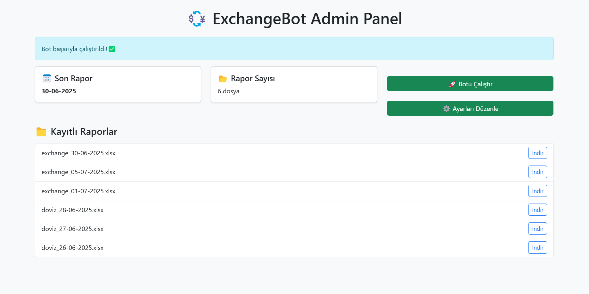

# 💱 Exchange Rate Automation Bot

A complete automation system that fetches **daily exchange rates (USD, EUR, GBP)** from the **Turkish Central Bank**, saves them in an **Excel report**, and sends them via **email** — all automatically at your configured schedule.

> ⚙️ Built with Python – Plus an optional Node.js Web Panel for control.

---

## 🚀 Features

- ✅ Fetches currency exchange data from **TCMB** (`today.xml`)
- 📁 Saves data to a cleanly formatted `.xlsx` file using **OpenPyXL**
- 📤 Sends daily report via **email** with file attached (SMTP)
- 🕘 Schedules automated runs using `schedule`
- 🌐 Optional **Web-based Admin Panel** for manual trigger & viewing reports
- ⚙️ Easily configurable via `settings.json`

---

## 🧰 Tech Stack

| Layer     | Technology       |
|-----------|------------------|
| Backend   | Python 3.10+     |
| Automation | `schedule`, `requests`, `openpyxl` |
| Email     | `smtplib`, `email`, `dotenv` |
| Web Panel | Node.js, Express, EJS (Optional) |
| Logging   | `logging` module |
| Format    | `.env`, `.json`, `.xlsx` |

---

## 📦 Installation

### 🔹 1. Clone the Repository

```bash
git clone https://github.com/iamblody/exchange-bot-demo.git
cd exchange-bot-demo
```

### 🔹 2. Install Python Dependencies

```bash
pip install -r requirements.txt
```

---

## 🔐 Setup Email Credentials

Create a file named `pass.env` in the root folder:

```env
MAIL_USER=youremail@gmail.com
MAIL_PASSWORD=your_app_password
```

> ⚠️ Use an **App Password** (e.g., for Gmail): [Google App Passwords Guide](https://support.google.com/accounts/answer/185833)

---

## ⚙️ Configuration (`settings.json`)

Edit or generate your settings using the CLI (`config_creator.py`), or manually:

```json
{
  "recipient_email": "yourrecipient@example.com",
  "send_time": "09:00",
  "currencies": ["USD", "EUR", "GBP"]
}
```

## ▶️ Run the Bot

### 🔹 Manual Trigger

```bash
python main.py
```

### 🔹 Daily Auto-Scheduler

Run and keep it running (on a server, VPS, or background process):

```bash
python main.py
```

---

## 🌐 Optional Web Panel

Navigate to `/web` folder to use the control panel.

### 🛠 Install Node.js dependencies

```bash
cd web
npm install
```

### ▶️ Run Panel

```bash
node app.js
```

Then visit: [http://localhost:3333](http://localhost:3333)

- Manual trigger
- List + download reports
- Update settings (via panel)
- Simple admin UI with Bootstrap

---

## 🖼️ Screenshot

> Replace with your actual image if available



---

## ⚠️ License Notice

This repository is for **educational & demonstration** purposes.

**❌ You may NOT:**
- Use this in commercial products
- Re-upload or resell
- Claim as your own without credit

**✅ You may:**
- Study, fork, and improve it for personal use
- Contact for custom use cases or licensing

📧 Contact: **muh4mmetdurgun@gmail.com**

---

## 📣 Follow & Contact

- Twitter/X: [@iamblody](https://x.com/iamblody)
- LinkedIn: [Muhammet Durgun](www.linkedin.com/in/muhammetdurgun)
- GitHub: [github.com/iamblody](https://github.com/iamblody)

---

> 🤖 Built with passion and caffeine ☕ by **Blody**